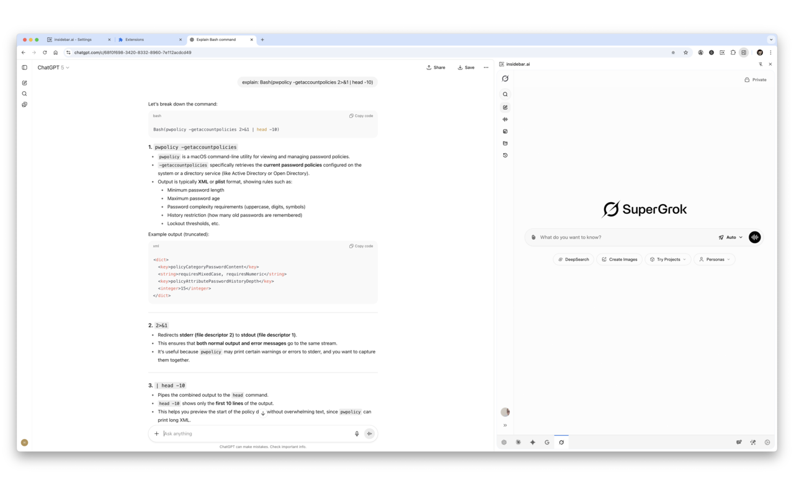
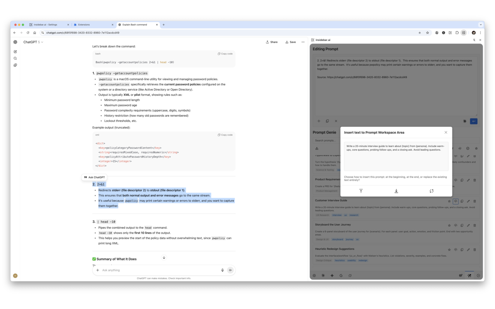
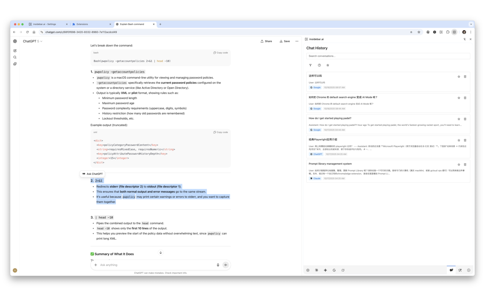
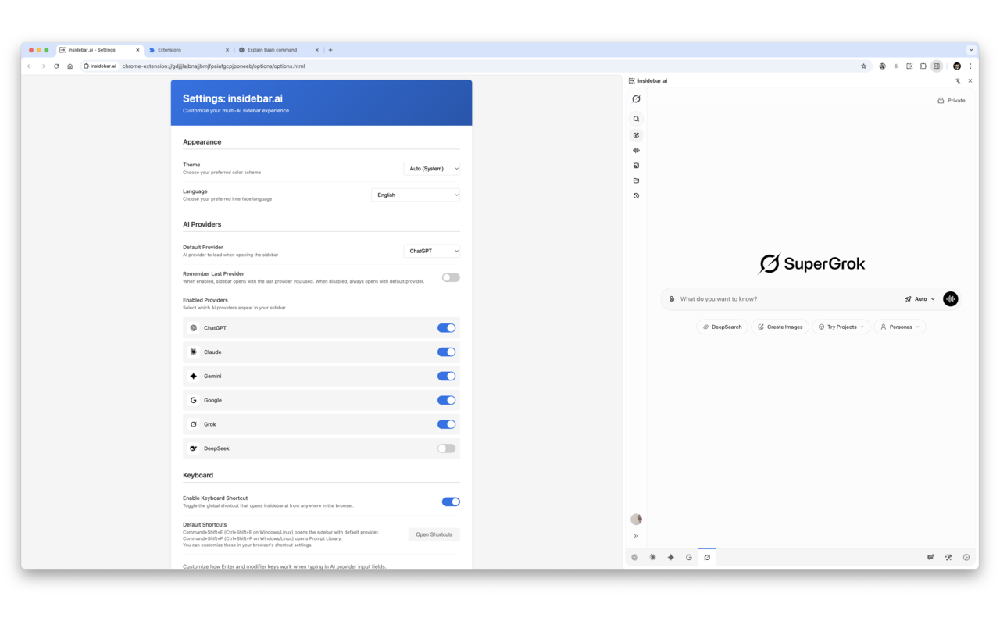
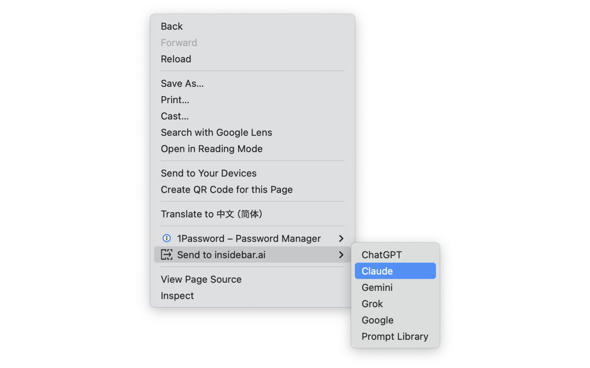
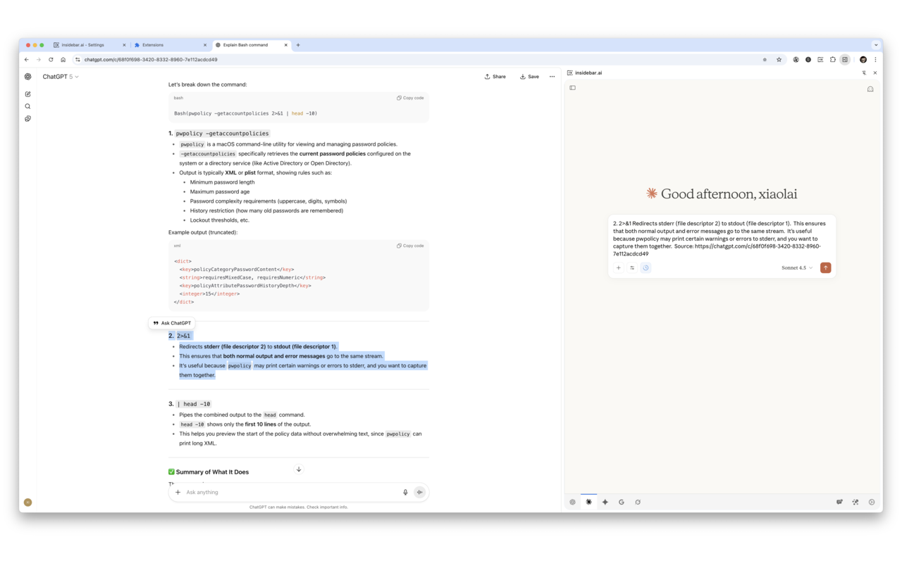
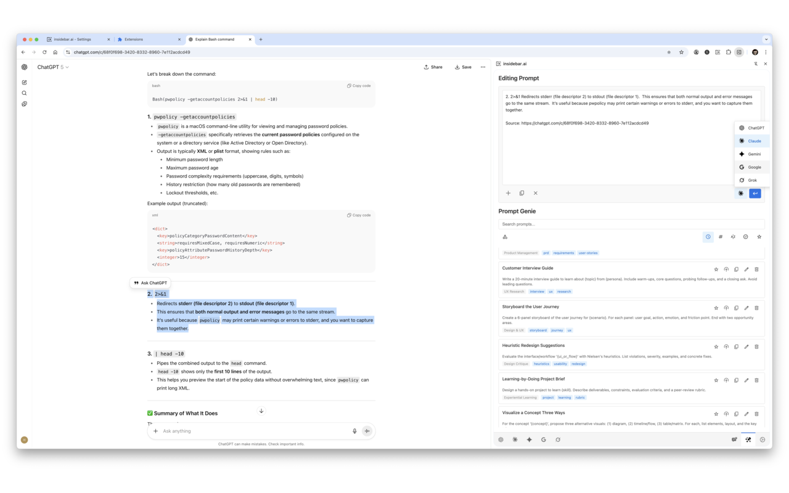

# insidebar.ai

> Your AI command center: ChatGPT, Claude, Gemini, Google AI, Grok, and DeepSeek—all in one sidebar

**Quick access to multiple AI assistants without switching tabs.** Open the sidebar, choose your AI, and start chatting. All your AI conversations in one place, with your existing logins.

---

## Quick Navigation

- [Features](#features)
- [Installation](#installation)
  - [Chrome Web Store (Recommended)](#chrome-web-store-recommended)
  - [Manual Installation (Advanced)](#manual-installation-advanced)
- [Supported AI Providers](#supported-ai-providers)
- [How to Use](#how-to-use)
- [Screenshots](#screenshots)
- [Privacy & Security](#privacy--security)
- [Troubleshooting](#troubleshooting)
- [Support & Contributing](#support--contributing)

---

## Features

### 🤖 6 AI Providers in One Sidebar

ChatGPT, Claude, Gemini, Google AI Mode, Grok, and DeepSeek — all accessible with one click. No more juggling tabs.

Switch between providers using the tabs at the bottom of the sidebar. Each session persists, so you can return to any conversation right where you left off.

### 📚 Prompt Library

Save, organize, and reuse your best prompts across any AI provider.

- **50+ Curated Prompts**: Import a starter library covering coding, writing, analysis, and more
- **Categories & Tags**: Organize prompts for easy discovery
- **Variables Support**: Create dynamic templates with placeholders
- **Search & Filter**: Find prompts instantly by keyword or favorite status
- **Import/Export**: Share prompt libraries or back up your collection

### 💬 Chat History

Save important conversations from any AI provider. Never lose a valuable discussion.

- **Universal Saving**: Works with ChatGPT, Claude, Gemini, Grok, and DeepSeek
- **Full Markdown Rendering**: Conversations display beautifully with code highlighting
- **Search & Filter**: Find conversations by provider or content
- **Original Links**: Access the original conversation URL anytime

### ⌨️ Powerful Keyboard Shortcuts

- **`Cmd/Ctrl+Shift+E`**: Open sidebar instantly
- **`Cmd/Ctrl+Shift+P`**: Access prompt library
- **Customizable Enter Behavior**: Configure Enter vs Shift+Enter for each AI provider
  - Choose from presets: Default, Swapped, Slack-style, Discord-style, or create your own

### 🎨 Your Preferences, Your Way

**Source URL Control** (New in v1.6.0)
Choose where URLs appear when sending selected text or page content:
- At the end (after content)
- At the beginning (before content)
- Don't include URL (save tokens)

**Theme Customization**
Auto-detect system theme or set Light/Dark mode manually

**Language Support**
Available in 10 languages: English, Chinese (Simplified & Traditional), Japanese, Korean, Spanish, French, German, Italian, and Russian

**Provider Management**
Enable only the AI providers you use. Set your default provider.

### 🔒 Privacy First

- **No API keys required**—uses your existing browser logins
- **All data stays local** in your browser's storage
- **Zero tracking, zero analytics**—we don't collect anything
- **Fully open source**—review the code before installing

---

## Installation

Choose your installation method:

### Chrome Web Store (Recommended)

**One-click installation. Automatic updates. No developer mode needed.**

1. Visit the [Chrome Web Store page](https://chrome.google.com/webstore/detail/insidebar-ai/[ID])
2. Click **"Add to Chrome"**
3. Click **"Add Extension"** in the popup
4. Done! Click the extension icon or press `Cmd/Ctrl+Shift+E`

**Also works on Microsoft Edge:** Install from Chrome Web Store using Edge browser.

---

### Manual Installation (Advanced)

**For developers or users who prefer manual control.**

Perfect if you want to:
- Review the source code before installing
- Install a development or unreleased version
- Avoid automatic updates
- Have full control over when to update

<b>Click to expand: Manual installation instructions</b>

#### Chrome Installation

1. **Download** the latest release from [GitHub Releases](https://github.com/xiaolai/insidebar-ai/releases) or click **Code → Download ZIP** on the main repository page
2. **Extract** the ZIP file to a permanent location (don't delete this folder after installation)
3. **Open Chrome** and navigate to `chrome://extensions/`
4. **Enable** "Developer mode" using the toggle in the top right corner
5. **Click** "Load unpacked" button
6. **Select** the extracted folder containing `manifest.json`
7. **Done!** The extension icon appears in your toolbar

#### Microsoft Edge Installation

1. **Download and extract** the ZIP file (same as Chrome step 1-2)
2. **Open Edge** and navigate to `edge://extensions/`
3. **Enable** "Developer mode" in the left sidebar
4. **Click** "Load unpacked" button
5. **Select** the extracted folder
6. **Done!**

#### Common Questions

**Q: Why does it say "Developer mode extensions"?**
This is normal for manually installed extensions. It doesn't mean the extension is unsafe—just that it wasn't installed from the store.

**Q: Will this work permanently?**
Yes! Once installed, it stays installed. Chrome/Edge may show a warning banner about developer mode extensions—you can dismiss it.

**Q: How do I update manually installed extensions?**
Download the latest version from GitHub, remove the old extension from `chrome://extensions/`, and install the new version following the same steps. Your settings and prompts are stored separately and won't be deleted.

---

## Supported AI Providers

| Provider | Type | Website |
|----------|------|---------|
| **ChatGPT** | Full Sidebar | https://chat.openai.com |
| **Claude** | Full Sidebar | https://claude.ai |
| **Gemini** | Full Sidebar | https://gemini.google.com |
| **Google AI** | Search Enhancement | https://google.com (AI Mode) |
| **Grok** | Full Sidebar | https://grok.com |
| **DeepSeek** | Full Sidebar | https://chat.deepseek.com |

**No API keys required.** Just log into the providers you want to use in your browser, and insidebar.ai will use those existing sessions.

---

## How to Use

### First-Time Setup

1. **Log into your AI providers**
   Visit the websites of the AI providers you want to use (ChatGPT, Claude, etc.) and log in normally. The extension will use these existing sessions.

2. **Open the sidebar**
   Click the extension icon in your toolbar, or press `Cmd+Shift+E` (Mac) / `Ctrl+Shift+E` (Windows/Linux).

3. **Start chatting**
   Select an AI provider from the tabs at the bottom of the sidebar. The AI interface loads directly—same as using it in a regular tab.

4. **Customize (optional)**
   Click the gear icon to access Settings and configure keyboard shortcuts, theme, enabled providers, and more.

### Opening the Sidebar

**Keyboard shortcut:** `Cmd/Ctrl+Shift+E`
**Extension icon:** Click the icon in your browser toolbar
**Right-click menu:** Right-click on any webpage → "Send to insidebar.ai" → choose a provider

### Switching AI Providers

The bottom of the sidebar shows tabs for each enabled provider. Click a tab to switch to that AI. Your sessions persist—switching back returns you to where you left off.

### Using the Prompt Library

Press `Cmd/Ctrl+Shift+P` to open the Prompt Library, or click the notebook icon at the bottom of the sidebar.

**Create a prompt:**
Click "New Prompt", enter a title, content, and optional category/tags. Click Save.

**Use a prompt:**
Click any prompt card to copy it to your clipboard, then paste it into the AI chat input.

**Insert into workspace:**
Click the circular arrow icon on a prompt to insert it into the editing workspace. From there, you can:
- Compose multi-part prompts
- Edit before sending
- Send to any AI provider with one click

**Organize prompts:**
Use categories (Coding, Writing, Analysis, or create your own custom categories). Add tags for easy searching. Mark favorites using the star icon for quick access.

**Import default prompts:**
Open Settings and click "Import Default Prompts" to load a starter collection of 50+ curated prompts covering coding, writing, analysis, and general use.

**Import custom prompts:**
Click "Import Custom Prompts" to load your own prompt libraries. Files must be in JSON format. The extension validates the format and shows helpful error messages if the structure is incorrect.

### Saving Chat History

While viewing a conversation in any supported AI provider (ChatGPT, Claude, Gemini, Grok, DeepSeek), click the save button that appears at the top of the chat interface.

The conversation is saved locally with:
- Full message content with markdown rendering
- Original conversation URL
- Provider and timestamp

Access saved conversations anytime by clicking the history icon in the sidebar.

### Sending Selected Text to AI

1. **Select text** on any webpage
2. **Right-click** and choose "Send to insidebar.ai"
3. **Choose a provider** (ChatGPT, Claude, etc.)
4. The sidebar opens with your selected text ready to send

You can configure whether the source URL appears at the beginning, end, or not at all in Settings → Content Sending.

### Customizing Keyboard Shortcuts

**Chrome:** Navigate to `chrome://extensions/shortcuts`
**Edge:** Navigate to `edge://extensions/shortcuts`

Find "insidebar.ai" in the list and click the pencil icon to customize:
- Open sidebar shortcut
- Open Prompt Library shortcut

**Note:** Some key combinations may conflict with other extensions or browser shortcuts. Choose combinations that don't conflict.

### Settings Overview

Click the gear icon at the bottom of the sidebar to access Settings.

**Appearance**
Choose Auto (follows system), Light, or Dark theme

**AI Providers**
Enable or disable specific providers. Only enabled providers appear in the sidebar tabs. Set your default provider (loads when you first open the sidebar).

**Keyboard**
- Toggle keyboard shortcuts on/off
- Customize Enter key behavior for each AI provider
  - Presets: Default, Swapped, Slack-style, Discord-style
  - Custom: Define your own key combinations for sending vs new line

**Chat History**
View statistics about saved conversations. Export or clear history.

**Prompt Library**
- Import default prompt library (50+ curated prompts)
- Import custom prompt libraries (JSON format)
- View prompt count and storage usage

**Content Sending** (New in v1.6.0)
Choose where source URLs appear when sending selected text or page content:
- At end (after content)
- At beginning (before content)
- Don't include URL

**Data Management**
- View storage usage for prompts and chat history
- Export all data as backup (JSON format)
- Import previously exported data
- Reset all data if needed

---

## Screenshots

<table>
  <tr>
    <td width="50%">
      
      
<em>Right-click to send selected text to any AI</em>

    </td>
    <td width="50%">
      
      
<em>Customize keyboard shortcuts, enter behavior, and more</em>

    </td>
  </tr>
  <tr>
    <td width="50%">
      
      
<em>Compose prompts and send to any provider</em>

    </td>
    <td width="50%">
      
      
<em>Save and organize conversations from any AI</em>

    </td>
  </tr>
</table>

---

## Privacy & Security

📄 **[Read our full Privacy Policy](PRIVACY.md)**

**Your data stays local.** All prompts, settings, and saved conversations are stored in your browser's local storage. Nothing is sent to external servers.

**No API keys required.** The extension uses your existing browser login sessions. It loads the real AI websites in the sidebar using your cookies—just like opening them in a new tab.

**No tracking.** The extension doesn't collect analytics, usage data, or any personal information. Zero telemetry.

**How it works technically:** The extension uses Chrome's `declarativeNetRequest` API to bypass X-Frame-Options headers, allowing AI provider websites to load in the sidebar iframe. This is the same security mechanism that extensions like password managers use. All code is open source and available for review.

**Cookie-based authentication:** When you log into an AI provider (like ChatGPT) in your browser, the extension can access those same login sessions to load the provider in the sidebar. Your credentials never pass through the extension—authentication is handled entirely by the AI provider's website.

---

## Troubleshooting

### Extension Issues

**The extension won't load**
Make sure you're using a recent version of Chrome (114+) or Edge (114+). Older versions don't support the required APIs.

**Extension icon doesn't appear in toolbar**
Click the puzzle piece icon in Chrome/Edge toolbar and pin "insidebar.ai" to make it always visible.

### AI Provider Issues

**An AI provider won't load in the sidebar**
1. First, visit that provider's website in a regular browser tab and log in
2. The extension needs an active login session to work
3. If still not working, try clearing your browser cache and cookies for that specific provider
4. Some providers may have regional restrictions or require specific account types

**Provider loads but shows login page**
Your session may have expired. Open the provider in a regular tab, log in again, then refresh the sidebar.

### Feature Issues

**Keyboard shortcuts don't work**
1. Check if another extension is using the same shortcut
2. Go to `chrome://extensions/shortcuts` (or `edge://extensions/shortcuts`)
3. View all shortcuts and change insidebar.ai shortcuts if needed
4. Some shortcuts may conflict with browser or OS hotkeys—try different combinations

**Dark mode isn't working**
1. Open Settings (gear icon)
2. Check the Theme dropdown
3. If set to "Auto", it follows your system theme
4. Change to "Dark" to force dark mode regardless of system setting

**Prompt Library keyboard shortcut opens but stays blank**
1. Check browser console for errors (F12 → Console tab)
2. Try refreshing the sidebar
3. If using manual installation, ensure you're using the latest version

**Chat History save button doesn't appear**
1. Make sure you're viewing an actual conversation (not the AI's home screen)
2. The save button appears at the top of the chat interface
3. Currently supported: ChatGPT, Claude, Gemini, Grok, DeepSeek

**Update checking shows old version**
- **Chrome Web Store installation**: Update checking is disabled (the store handles updates automatically)
- **Manual installation**: Click "Check for Updates" in Settings to see if a newer version is available on GitHub

### Settings & Data

**Settings aren't saving**
Check if you have sufficient storage quota in your browser. Go to Settings → Data Management to view storage usage.

**Lost all my prompts/settings**
If you cleared browser data or reinstalled the browser, local storage may have been wiped. This is why we recommend periodically exporting your data (Settings → Data Management → Export).

**Import fails with "Invalid JSON format"**
Ensure the file is valid JSON. Use a JSON validator if needed. For custom prompt libraries, check the structure matches the expected format (see `data/prompt-libraries/Generate_a_Basic_Prompt_Library.md`).

---

## Support & Contributing

### Found a Bug or Have a Feature Idea?

- **Open an issue**: [GitHub Issues](https://github.com/xiaolai/insidebar-ai/issues)
- **View changelog**: [CHANGELOG.md](CHANGELOG.md)
- **Star this repo**: If you find insidebar.ai useful, [give it a star](https://github.com/xiaolai/insidebar-ai)!

### Contributing

Contributions are welcome! Whether it's:
- Reporting bugs
- Suggesting features
- Improving documentation
- Translating to new languages
- Submitting pull requests

Please check existing issues before opening a new one.

---

## License

MIT License - see the [LICENSE](LICENSE) file for details.

---

**Built by [Xiaolai](https://github.com/xiaolai)** • Available in 10 languages • Open source & privacy-focused
